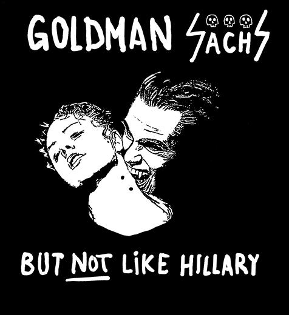

# Minusinė Bramos akis

> "'Minusinė Bramos akis' - pusiau sąmoningas randominis neuronų tinklas, suteikiantis ribotą prieigą prie visų praeities įvykių, palikusių elektroninį arba šviesos atspaudą, net jeigu tas atspaudas jau sunaikintas."
> - Viktor Pelevin, "iPhuck 10", 2017, 207-208pp"

## License

Copyright &copy; 2019 [Dainius Jocas](https://www.jocas.lt).

Distributed under the The Apache License, Version 2.0.
